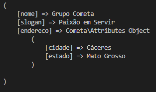

# Attributes

## 📦 Install

```bash

composer require grupo-cometa/attributes

```

## 🔨 Usage

```php

<?php

require __DIR__.'/vendor/autoload.php';

use Cometa\Attributes;

$empresa = new Attributes;

$empresa->nome = 'Grupo Cometa';
$empresa->slogan = 'Paixão em Servir';
$empresa->endereco->cidade = 'Cáceres';
$empresa->endereco->estado = 'Mato Grosso';

```
### Result
<h1 align="center">
  
</h1>
